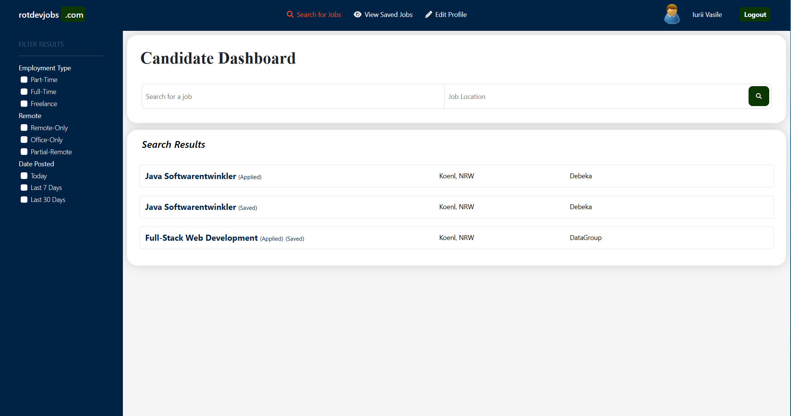

# JobPortal

JobPortal ist eine Webanwendung, die die Interaktion zwischen Arbeitgebern und Bewerbern erleichtert. Die Anwendung ermöglicht es Nutzern, Konten zu erstellen, nach verfügbaren Jobs zu suchen, sich auf Stellen zu bewerben und ihre Bewerbungen zu verwalten.

## Hauptmerkmale

- **Authentifizierung und Autorisierung:** Verwendung von Spring Security zur Verwaltung der Benutzer- und Zugangssicherheit.
- **Modernes Design:** Die Anwendung nutzt Thymeleaf und Bootstrap für ansprechende und benutzerfreundliche Seiten.
- **Datenbank-Interaktion:** Hibernate und JPA werden für den Zugriff und die Verwaltung von Daten in MySQL verwendet.
- **Datenbankmigrationen:** Einsatz von Liquibase für die Versionskontrolle der Datenbank.
- **REST-Funktionalität:** Bereitstellung von REST-Endpunkten zur Erweiterung und Integration der Anwendung.

## Verwendete Technologien

- **Backend:** Spring Boot 3.3.0, Spring Data JPA, Spring Security, Hibernate
- **Frontend:** Thymeleaf, Bootstrap 5, jQuery
- **Datenbank:** MySQL
- **Weitere Werkzeuge:** Liquibase zur Datenbankmigration, Lombok zur Reduktion von Boilerplate-Code, Spring Boot DevTools für eine schnellere Entwicklung

## Systemanforderungen

- **Java 21** - Stelle sicher, dass Java 21 oder eine neuere Version installiert ist.
- **MySQL** - Für die Datenspeicherung der Anwendung.
- **Maven** - Wird für das Abhängigkeitsmanagement und das Erstellen der Anwendung verwendet.

## Installation

1. Klone dieses Repository:
    ```bash
    git clone https://github.com/benutzer/jobPortal.git
    ```
2. Wechsle in das Projektverzeichnis:
    ```bash
    cd jobPortal
    ```
3. Datenbank konfigurieren:
    - Erstelle eine MySQL-Datenbank mit dem Namen `jobportal`.
    - Aktualisiere die `application.properties`-Datei mit den Zugangsdaten zur Datenbank.

4. Starte die Anwendung:
    ```bash
    mvn spring-boot:run
    ```

Die Anwendung ist dann unter [http://localhost:8080](http://localhost:8080) verfügbar.

## Anwendung

Nach dem Start der Anwendung können Nutzer:
- **Jobs durchsuchen:** Bewerber können die Liste der verfügbaren Jobs einsehen.
- **Auf Jobs bewerben:** Registrierte Benutzer können sich auf ausgeschriebene Stellen bewerben.
- **Jobs verwalten:** Arbeitgeber können Stellenanzeigen erstellen und bearbeiten.
- **Kontoverwaltung:** Benutzer können Konten erstellen und sich anmelden, um auf erweiterte Funktionen zuzugreifen.

## Projektstruktur

- `src/main/java` - Hauptquelle der Anwendungslogik.
- `src/main/resources/templates` - HTML-Dateien für Thymeleaf.
- `src/main/resources/static` - Statische Ressourcen wie CSS, JavaScript, Bilder.

## Mitwirken

Beiträge sind willkommen! Bitte öffne einen Pull Request mit Verbesserungsvorschlägen oder zur Behebung von Problemen.

## Kontakt

Für weitere Fragen schicke eine E-Mail an iurii.rotari.1987@gmail.com.





